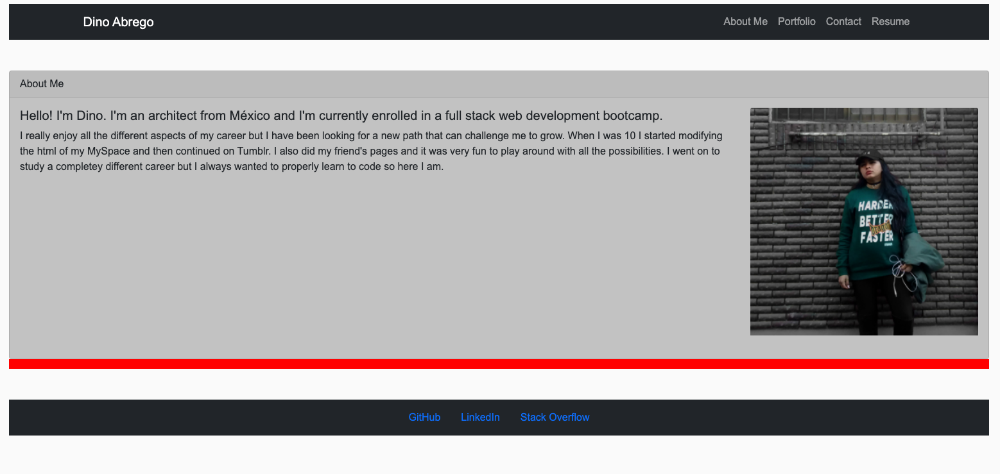
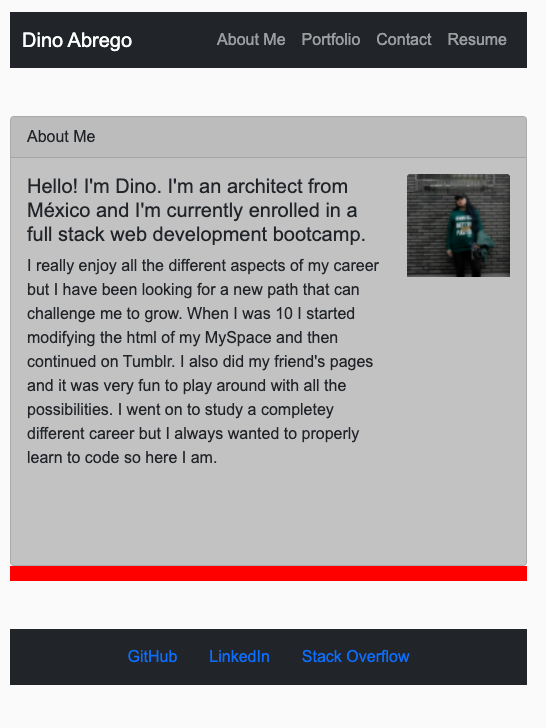

# My Portfolio

## Description
This is the newest version of my portfolio, created using React. It is a single page application that uses a container to load pages without refreshing the app. It was built using React Router for linking the pages, and
Bootstrap for react for the interface.
I used the design of my previous portfolio (https://dinoabrego.github.io/myportfolio/) and the color scheme for a base, but translated the elements to react and adapted them to work in a single page setting with each eleemnt being its own page instead of scrolling down.
This was a fun project to work in and apply the knowledge in React.

## Deployed Application

https://dinoabrego.github.io/my-portfolio/

## Website Appearance

It was built with responsive design in mind, so elements are adaptable to different size of screens.

